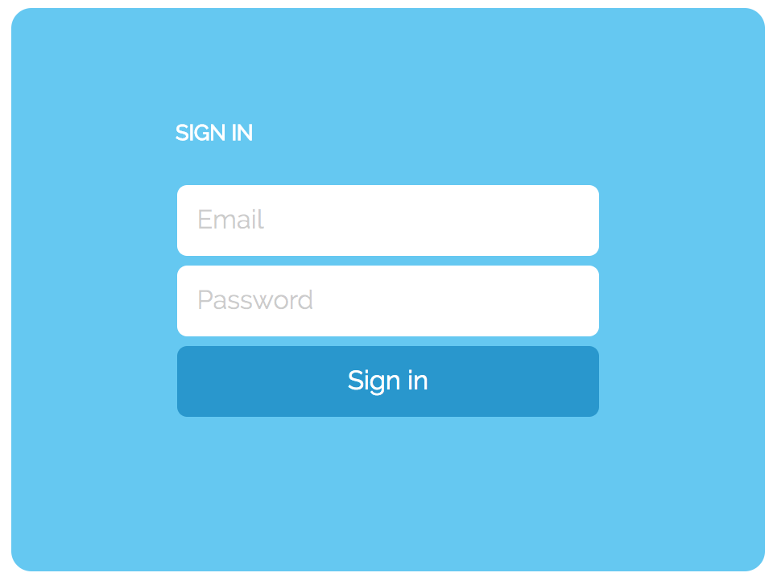

# Georgiy's test tasks!
Solutions to https://docs.google.com/document/d/10kAifjCE0-J6vBh5GxyZ98I-xFDUsqIMtpYh_ITAgkc/edit#

## Task 1
<br>
[To the repo ->](https://github.com/ururualeksi/test-tasks/tree/master/task1)
<br>
## Task 2
<br>
<br>
## Task 3
```javascript
(function montypython(count) {
  var s = '';

  for (let i = 1; i < 101; i++) {
    if (i % 3 == 0) {
      s+='Monty';
    };
    if (i % 5 == 0) {
      s+='Python';
    };

    if(s) console.log(s);
    s = '';
  }
})();

```
<br>

## Task 4
<br>
<br>

## Task 5
<br>
